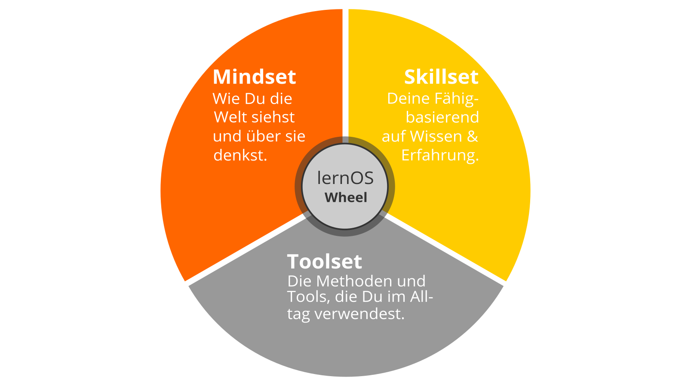

------

## lernOS Wheel: Mindset, Skillset und Toolset

Du kannst im Verlauf dieses Lernpfades Deine Einstellung, Deine Werte,
Deine Glaubenssätze, Deine Fähigkeiten und deren Anwendungen
hinterfragen, reflektieren und womöglich sogar ändern. Dabei helfen Dir
die drei Dimensionen von LernOS: Mindset, Skillset und Toolset. Die
besten Ergebnisse erzielst Du, wenn Du alle drei Dimensionen im
persönlichen Entwicklungsprozess berücksichtigst, doch auch die
Konzentration auf eine oder zwei werden Dimensionen hilft Dir weiter.

### Mindset: Deine Haltung

Das Mindset beschreibt Deine Haltung, Deine Einstellung und Deine Werte.

**Tipp:** Dein Mindset ist nicht in Stein gemeißelt, es kann sich mit
der Zeit verändern. Schaue Dir das Video [Developing a Growth
Mindset](https://www.youtube.com/watch?v=hiiEeMN7vbQ) von Carol Dweck
an, um mehr darüber zu erfahren.

### Skillset: Deine Fähigkeiten

Indem Du die Methoden der Achtsamkeit für Dich anwendest, erweiterst Du
Deine Fähigkeiten und lernst Dich selbst besser kennen …

und vieles mehr ...

### Toolset: Tools, die Du verwendest 

Du lernst auf Deiner Reise Methoden kennen, die Du als Werkzeuge nutzen
kannst, um Dich weiterzuentwickeln. Einige dieser Methoden, auch
‚Praxis‘ genannt, führen Dich zu größerer Achtsamkeit, andere lehren
Dich, wie Du in einer Peer-Gruppe lernst und zusammenarbeitest …

und vieles mehr ...