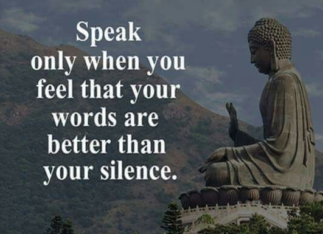

## Woche 7: Balance und achtsame Kommunikation

In dieser Woche geht es um die Balance und verschiedene Perspektiven

-   **Check-In:** Herzlich willkommen! *(5 Minuten)*

-   **Austausch / Reflexion:** in der Gruppe *(10 Minuten)*

-   **Thema:** Balance *(5 Minuten)*

-   **Übung:** Achtsame Kommunikation *(20 Minuten)*

-   **Erfahrungsaustausch:** Wie ging es mir in der Übung *(10 Minuten)*

-   **Was nehme ich mir vor** *(5 Minuten)*

-   **Check-out** *(5 Minuten)*

-   **Bild / Zitat der Woche und weiterführende Links**

### Check-In *(5 Minuten)*

-   Wie geht es Dir gerade?

-   Was beschäftigt Dich zurzeit?

-   Hinweis: Versuche, Dich kurz zu fassen und “achtsam” zu sein.

### Austausch / Reflexion *(10 Minuten)*

-   Wie ist Dir die Umsetzung gelungen?

-   Was war besonders gut? Welche Hindernisse gab es?

-   Welche Erkenntnisse hattest Du beim Schreiben?

### Thema: Balance und achtsame Kommunikation *(5 Minuten)*

In diesem Kurs hast Du bereits viel über Dich gelernt und erfahren.
Vielleicht auch neue Aspekte an Dir erkannt. Bestimmt hast Du auch schon
festgestellt, dass die anderen ganz andere Gedanken, Wünsche, Vorlieben
und Sichtweisen haben. Jeder sieht die Dinge, die “Realität” aus seinen
Augen und jeder sieht und denkt etwas anders. Jeder lebt sozusagen in
seiner Welt, die durch die eigene Herkunft und Erfahrungen geprägt ist.
Sicher ist Dir schon aufgefallen, dass dabei leicht Missverständnisse
auftreten oder unterschiedliche Wahrnehmungen unvermeidbar sind. Und
dass auch Deine Sicht der Dinge nicht die Wirklichkeit, sondern Deine
Landkarte der Realität sind. Daher ist eine gelungene Kommunikation ein
herausforderndes, aber auch wichtiges Unterfangen.

Achtsames Zuhören: Wir hören sehr oft nicht wirklich zu oder lassen uns
von anderen unterbrechen, die dann mit ihrem Thema weitermachen.

Du kennst sicher das aktive Zuhören. Es geht dabei darum, so aufmerksam
zuzuhören, dass Du den Inhalt in Deinen Worten wiederholen kannst.
Gleichzeitig bist Du Dir dabei bewusst, dass Du nur einen Teil von dem,
was im Anderen vorgeht verstehen und wiedergeben kannst.

Bei der achtsamen Kommunikation, geht es zum einen um Präsenz und
Wertfreiheit. Es gilt beim Zuhören wahrzunehmen, was der Andere erzählt,
gleichzeitig aber auch bei sich selbst zu spüren, was der Input in einem
selbst auslöst. Und dabei sich nicht von den eigenen Gedanken wegtragen
zu lassen, durch die eigenen inneren Trigger.

Hier ist eine gute Balance zwischen Zuhören (Fokus im Außen) und
Wahrnehmung Deiner Reaktion (Fokus im Innen) wichtig. Erkenne den
Unterschied zwischen der Wahrnehmung und der eigenen inneren Reaktion
(Wertung) und den daraus entstehenden Gedanken. Wenn Du dabei ganz
aufmerksam bist, bleibt gar nicht mehr viel Raum, Dir zu überlegen, was
Du selbst sagen willst. ;-) Denn wenn ich höre, dann höre ich …

Wenn Du dann selbst redest, ist es ebenso wichtig, sich wahrzunehmen,
auf die inneren Impulse zu hören und daraus sprechen. Das haben wir im
achtsamen Schreiben schon geübt. Erst einmal still zu werden und in sich
zu lauschen. Das wahrzunehmen, was geschrieben werden will oder in dem
Fall gesagt werden will. Vielleicht auch einmal nicht so genau zu
wissen, wo das Gesagte in dem Moment genau her kommt …

### Übung: Achtsame Kommunikation *(20 Minuten)*

=&gt; Jeder redet 2 Minuten. Alle nacheinander. Erzähle einfach, was Dir
in den Sinn kommt oder auch vom letzten Urlaub, der letzten Feier, der
letzten Achtsamkeits- Übung .... (der Inhalt spielt keine große Rolle).
Die Anderen hören achtsam zu.  
Achte beim Zuhören darauf, ganz bei dem zu sein, was Du hörst und was es
in Dir auslöst, welche Körperempfindungen dabei entstehen.

Wenn Du an der Reihe bist, komme erst einmal bei Dir an, atme tief
durch, werde innerlich still und fange dann an zu reden, wenn es für
Dich stimmig ist. Nimm ggf. wahr, wie es Dir innerlich geht, wenn Du
redest. Spüre Deine körperlichen und emotionalen Empfindungen.

Dann kommt ein kurzer Austausch darüber, wie es jedem ging. (5 Min.,
jeder ca 1 Min.).

Dann noch eine zweite Runde in der gleichen Weise. D.h. die nächste
erzählt und nimmt sich wahr. Der Andere hört zu und nimmt sich wahr.
Diesmal zu zweit. Wenn ihr eine ungerade Zahl seid, dann macht ein 3-er
Setting.

Tipp: Bei Online Meetings das zweier-Setting entsprechend
organisieren. Z.B. eine feste Zeit ausmachen (z.B. 5 Minuten). Die
Zweier - Teams gehen in separate Besprechungen. Bei ungerader
Teilnehmerzahl, könnt ihr eine dreier- Runde machen. Wenn einzelne sich
verspäten, dann ggf. zurück rufen. Eine Videoaufnahme hilft bei der
Übung.

### Erfahrungsaustausch *(10 Minuten)*

-   Wie ging es Dir in der Übung?

-   Wie hat es sich angefühlt?

-   Was ist Dir aufgefallen? Was hat Dich überrascht?

-   Welche Ähnlichkeiten und Unterschiede hast Du wahrgenommen in Deiner
    Wahrnehmung und der der anderen?

-   Welche Veränderungen gab es in der zweiten (ggf. folgenden)
    Runde(n)?

### Was nehme ich mir vor *(5 Minuten)*

Führe die Kommunikations-Übung möglichst regelmäßig durch. Beobachte
Dich in der Woche mindestens einmal täglich bei der Kommunikation.
Sowohl im Reden, als auch im Zuhören. Was fällt Dir dabei auf? Welche
Muster kannst Du erkennen? Ist es anders, wenn Du bewusst bist beim
Reden und Zuhören?

Wieder empfehlen wir, diese Übung über einen längeren Zeitraum täglich
durchzuführen, um Klarheit über die veränderlichen und sich
wiederholende Aspekte zu gewinnen.

Rede mit anderen darüber, wie die Kommunikation mit Dir bei Deinem
Gegenüber ankommt. Ggf. magst Du Dich auch darüber austauschen, wie
diese die Kommunikation erleben. Ist es da anders oder ähnlich?

Wie magst Du in der kommenden Woche mit den Empfehlungen umgehen?

### Check-out *(5 Minuten)*

-   Wie geht es Dir jetzt? 1 - 2 Worte genügen …

-   Was nimmst Du von heute mit? Was hat Dich besonders beeindruckt?

-   Was möchtest Du der Gruppe als Impuls mitgeben?

-   TIPP: Legt den Facilitator / Moderator für das nächste
    Treffen fest.

### BILD / Zitat der Woche: 

Bild von
[Pixabay](https://pixabay.com/de/?utm_source=link-attribution&utm_medium=referral&utm_campaign=image&utm_content=2847508)

Es waren einmal fünf weise Gelehrte. Sie alle waren blind. Diese
Gelehrten wurden von ihrem König auf eine Reise geschickt und sollten
herausfinden, was ein Elefant ist. Und so machten sich die Blinden auf
die Reise nach Indien. Dort wurden sie von Helfern zu einem Elefanten
geführt. Die fünf Gelehrten standen nun um das Tier herum und
versuchten, sich durch Ertasten ein Bild von dem Elefanten zu machen.

Als sie zurück zu ihrem König kamen, sollten sie ihm nun über den
Elefanten berichten. Der erste Weise hatte am Kopf des Tieres gestanden
und den Rüssel des Elefanten betastet. Er sprach: "Ein Elefant ist wie
ein langer Arm."

Der zweite Gelehrte hatte das Ohr des Elefanten ertastet und sprach:
"Nein, ein Elefant ist vielmehr wie ein großer Fächer."

Der dritte Gelehrte sprach: "Aber nein, ein Elefant ist wie eine dicke
Säule." Er hatte ein Bein des Elefanten berührt.

Der vierte Weise sagte: "Also ich finde, ein Elefant ist wie eine kleine
Strippe mit ein paar Haaren am Ende", denn er hatte nur den Schwanz des
Elefanten ertastet.

Und der fünfte Weise berichtete seinem König: " Also ich sage, ein
Elefant ist wie ein riesige Masse, mit Rundungen und ein paar Borsten
darauf." Dieser Gelehrte hatte den Rumpf des Tieres berührt.

Nach diesen widersprüchlichen Äußerungen fürchteten die Gelehrten den
Zorn des Königs, konnten sie sich doch nicht darauf einigen, was ein
Elefant wirklich ist. Doch der König lächelte weise: "Ich danke Euch,
denn ich weiß nun, was ein Elefant ist: Ein Elefant ist ein Tier mit
einem Rüssel, der wie ein langer Arm ist, mit Ohren, die wie Fächer
sind, mit Beinen, die wie starke Säulen sind, mit einem Schwanz, der
einer kleinen Strippe mit ein paar Haaren daran gleicht und mit einem
Rumpf, der wie eine große Masse mit Rundungen und ein paar Borsten ist."

Die Gelehrten senkten beschämt ihren Kopf, nachdem sie erkannten, daß
jeder von ihnen nur einen Teil des Elefanten ertastet hatte und sie sich
zu schnell damit zufrieden gegeben hatten.

Verfasser unbekannt

### Weiterführende Links

**Wenn Du noch etwas Zeit hast:**

-   Achtsames Zuhören: Wir hören sehr oft nicht wirklich zu oder lassen
    uns von anderen unterbrechen, die dann mit ihrem Thema weitermachen.
    In diesem kurzen Video wird erklärt, woran das liegt und wie Du
    lernen kannst, selbst achtsamer zuzuhören. =&gt;
    [https://youtu.be/nXtVwglZbEw](https://youtu.be/nXtVwglZbEw)

-   Übung: Mache, bevor Du mit jemandem redest eine kurze Pause.
    Komme ganz bei Dir an und überlege, worum es in der Kommunikation
    gehen soll. Das kannst Du auch am Telefon oder Online- Meeting gut
    machen. Halte kurz inne, bevor Du ran gehst oder bevor die Runde
    startet. Fühle Dich und gehe erst dann bewusst in den Kontakt.

-   Weitere Erläuterung zur achtsamen Kommunikation:
    [https://ich-will-meditieren.de/achtsames-zuhoeren-achtsame-kommunikation/](https://ich-will-meditieren.de/achtsames-zuhoeren-achtsame-kommunikation/)

-   zum achtsamen Zuhören:
    [https://mymonk.de/wie-man-erleuchtung-durch-zuhoeren-finden-kann-8-regeln/](https://mymonk.de/wie-man-erleuchtung-durch-zuhoeren-finden-kann-8-regeln/)

-   Manchmal trügt unsere Wahrnehmung:
    [https://www.illusionen.biz/blog/?page\_id=57](https://www.illusionen.biz/blog/?page_id=57)

-   Die drei Filter des Sokrates:
    [https://gedankenwelt.de/die-drei-filter-des-sokrates/](https://gedankenwelt.de/die-drei-filter-des-sokrates/)

**Wenn Du mehr Zeit hast:**

-   NLP =&gt; über verschiedene Landkarten:
    [https://www.kikidan.com/nlp/nlp-grundannahmen/deine-landkarte-ist-nicht-die-landschaft/](https://www.kikidan.com/nlp/nlp-grundannahmen/deine-landkarte-ist-nicht-die-landschaft/)

-   Storytelling, eine weitere Seite der Kommunikation:
    [https://www.strategisches-storytelling.de/was-ist-storytelling/](https://www.strategisches-storytelling.de/was-ist-storytelling/)

-   Achtsame Kommunikation Teil 2: Subjektive Wahrnehmung (15:44 Min.):
    [https://www.youtube.com/watch?v=rGTJ3QLW2VI](https://www.youtube.com/watch?v=rGTJ3QLW2VI)

-   7Mind Podcast: Achtsam streiten, besser kommunizieren: So geht’s (30
    Min.):
    [https://www.youtube.com/watch?v=YcbvUrrWQxA](https://www.youtube.com/watch?v=YcbvUrrWQxA)