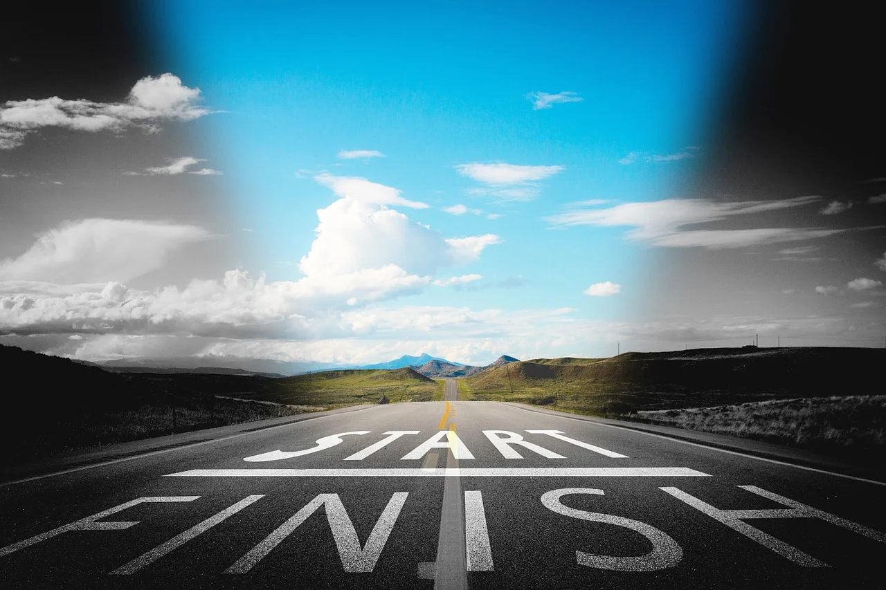

## Woche 12: Am Ende steht der Anfang - gemeinsamer Austausch

In dieser Woche ist das Ende des Kurses und Gleichzeitig wieder ein
Anfang ...

-   **Check-In:** Wie geht es Dir gerade? *(5 Minuten)*

-   **Austausch / Reflexion:** in der Gruppe *(10 Minuten)*

-   **Thema:** Austausch, Ende und Anfang *(5 Minuten*)

-   **Übung:** Wer bin ich jetzt? - Spiral-Übung *(10 Minuten)*

-   **Erfahrungsaustausch:** Was gibt es mitzuteilen *(20 Minuten)*

-   **Was nehme ich mir vor:** siehe unten *(5 Minuten)*

-   **Check-out** *(5 Minuten)*

-   **Bild / Zitat der Woche und weiterführende Links**

### Check-In *(5 Minuten)*

-   Wie geht es Dir gerade?

-   Was beschäftigt Dich zurzeit?

-   Hinweis: Versuche, Dich kurz zu fassen und “achtsam” zu sein.

### Austausch / Reflexion *(10 Minuten)*

-   Wie ist Dir die Umsetzung gelungen?

-   Was war besonders gut? Welche Hindernisse gab es?

-   Welche Erwartungen hast Du für diese Einheit?

### Thema: Austausch, Ende und Anfang (5 Minuten)

Über den Zeitraum dieses Kurses hast Du Deine Wahrnehmung geschult und
das Innere erforscht. Dabei bist Du Licht und Schatten in Dir begegnet
und hast Dich mit ihnen auseinandergesetzt. Du hast Dich ein wenig
besser kennengelernt. Vielleicht hat Dich auch die Frage nach dem, was
Du eigentlich bist aus [Woche
3](3-03-Ablenkung_Widerstaende.md) an der
einen oder anderen Stelle berührt. Vermutlich kannst Du jetzt ein wenig
freundlicher mit Dir und anderen Menschen umgehen, durch weniger
Bewertung und Vergleich. Oder Du erkennst die Wertungen, wenn sie
auftauchen und gibst ihnen weniger Gewicht.

In [Woche 11](3-11-Prioritaeten-Alltag.md)
hast Du eine Methode erlebt, die mit Deinem eigenen Zutun zu dauerhafter
Achtsamkeitspraxis führen können. Du magst erleben, wie Handlungen
direkt aus der Wahrnehmung entstehen. Dies führt mit der Zeit in ein
Leben im “Flow”.

Zuerst kommt eine Idee, die Ausrichtung, dann das Fühlen, später erst
folgt das Tun … und vielleicht kannst Du mehr und mehr zulassen … Räume
der Stille nutzen ... aus der Stille die Impulse wahrnehmen … den Fluss
fühlen … das Leben entstehen lassen … ohne Erwartung … aktiv werden …
immer wieder … neu …

Zur Bearbeitung von hartnäckigen, schwierigen Themen magst Du gerne auf
die Techniken der Schattenarbeit ([Woche
9](3-09-Schatten-SelbstWirksamkeit.md) oder Metta Meditationen ([Woche
10](3-10-Integration-Werte.md)) zurückgreifen.

Wie Dein weiterer Weg nun aussieht, kannst Du gut selbst für Dich
festlegen oder entstehen lassen. Es gibt so viele Möglichkeiten ...

### Übung: “Wer bin ich jetzt?” - Spiralübung (10 Minuten)

In dieser Übung geht es darum die Verbindung zwischen dem, was der
Vorsatz zu Beginn des Kurses war und dem, was nun folgt herzustellen.

Nimm Dir ein leeres Blatt (Din A4) und falte es 2x, damit Du vier
Quadranten hast und einen Stift.

**Audio-Datei [Achtsamkeit42_Woche12_Spiralübung_10min.mp3](https://archive.org/download/Achtsamkeit-42/Achtsamkeit42_Woche12_Spiral%C3%BCbung_10min.mp3)**

Das Audio führt Dich:

1.  Fokussiertes Tun (eine Spirale in die Mitte des Blattes
    malen; dabei in den vier Quadranten Platz für Text lassen) =&gt; 2
    Min. präsent sein

2.  4 Fragen beantworten / je Quadrant die Antwort auf eine Frage
    schreiben (je 2 Min.):

> \- Warum habe ich hier teilgenommen? Was habe ich mir zu Beginn
> vorgenommen?
>
> \- Wie habe ich diese Wochen erlebt? Was hat mich überrascht und/oder
> gefreut?
>
> \- Welche Erkenntnisse habe ich aus all dem gezogen? Was ist jetzt
> anders/neu?
>
> \- Wie soll es weitergehen? Was nehme ich mir für die Zukunft mit?

Zur Erinnerung: Überblick über den Kurs und die Übungen:  

### Erfahrungsaustausch (20 Minuten)

-   Austausch aus der Stille heraus =&gt; was möchte sich mitteilen … ?

-   … wenn ich nur eine Sache aus dem Kurs mitnehme, dann ist das …

-   … wenn ich mir nur eine Sache vornehme und umsetze, dann ist das …

Was möchtest Du mitteilen aus der Übung, aus dem Erleben, aus dem
Moment?

### Was nehme ich mir vor *(5 Minuten)*

Es wird wieder empfohlen diese Lernreise immer wieder über einen
längeren Zeitraum durchzuführen, um Klarheit in Deinem Leben und über
die veränderlichen und sich wiederholende Aspekte zu gewinnen. Mach Dir
am Besten einen Vorsatz dazu.

Willst Du diese ([oder eine andere)](http://lernos.org) Lernreise
in Deinem Leben regelmäßig machen? Wie und wann, entscheidest Du allein
… und für manchen kann es hilfreich sein, sich vor anderen zu
verpflichten ;-)

Wollt ihr vielleicht als Gruppe zusammen weitermachen? Vereinbart dazu
das weitere Vorgehen.

Wir empfehlen darüber hinaus, wenn bei regelmäßiger Meditationspraxis
Fragen oder Schwierigkeiten auftreten, sich begleiten zu lassen,
beispielsweise von Menschen mit Erfahrung in Zen oder christlicher
Kontemplation. Dadurch können das Abgleiten in Sackgassen oder auf
Seitenwege vermieden und die inneren Prozesse am Laufen gehalten werden.
Suche den Austausch, wenn Du fühlst, dass es Zeit dafür ist. Wende Dich
dazu an Menschen Deines Vertrauens, gerne auch an die Initiatoren dieses
Kurses. Email-Adressen:

-   Joachim
    ([Joachim.Schraud@gmx.de](mailto:Joachim.Schraud@gmx.de))

-   Reinhold
    ([Reinhold.Guthier@t-online.de](mailto:Reinhold.Guthier@t-online.de))

-   Hanne ([info@fritzcoaching.de](mailto:info@fritzcoaching.de))

-   Hardy
    ([harald.lauritsch@gmx.de](mailto:harald.lauritsch@gmx.de))

-   Nicole
    ([nicole.schwippl@siemens.com](mailto:nicole.schwippl@siemens.com))

### Check-out *(5 Minuten)*

-   Wie geht es Dir jetzt? 1 - 2 Worte genügen …

-   Was nimmst Du mit? Was hat Dich besonders beeindruckt?

-   Was möchtest Du der Gruppe noch mitteilen?

### BILD / Zitat der Woche

> “Befreiung entsteht durch Hingabe, nicht durch Einsicht des Verstandes”
>

> “Es gibt so viele Wege. Geh Deinen eigenen. Immer wieder.”
>

Bilder von geralt auf
[Pixabay](https://pixabay.com/de/?utm_source=link-attribution&utm_medium=referral&utm_campaign=image&utm_content=2847508)

### Weiterführende Links

-   Kurse am Benediktushof (bei Würzburg): ZEN und Kontemplation in der
    Nähe
    [https://www.benediktushof-holzkirchen.de/](https://www.benediktushof-holzkirchen.de/)

-   Kurse bei PSI online: verschiedene Internationale Lehrer, auf
    deutsch aufbereitet
    [https://www.psionline.news/unsere-onlinekurse/](https://www.psionline.news/unsere-onlinekurse/)

-   Kurse von Veit Lindau =&gt; Verbindung von Coaching und Innenschau,
    Fokus: Integrales Leben =&gt;
    [https://veitlindau.com/](https://veitlindau.com/) oder
    [https://homodea.com/](https://homodea.com/)

-   Kurse von Thich Nhat Hanh =&gt; bekannter Meditationslehrer des
    Buddhismus =&gt;
    [https://plumvillage.org/](https://plumvillage.org/)

-   Meditationen von Deepak Chopra: 21- Tage Programme zu verschiedenen
    Themen:
    [https://deepakchoprameditation.de/](https://deepakchoprameditation.de/)
    Thema Fülle frei auf YouTube!

-   Kurse / Bücher von Jack Kornfield und Tara Brach: Verbindung von
    Buddhismus und westlicher Psychologie:
    [https://jackkornfield.com/](https://jackkornfield.com/) und
    [https://www.tarabrach.com/](https://www.tarabrach.com/)

-   Kurse von Joe Dispenza: Fokus auf Umsetzung, wissenschaftlicher
    Hintergrund =&gt;
    [https://drjoedispenza.de/](https://drjoedispenza.de/)

-   Kurs von Michael Singer: Amerikanischer Lehrer, aus dem Leben und
    Business
    [https://untetheredsoul.com/](https://untetheredsoul.com/)

-   Buch “Coming to Wholeness” von Connirae Andreas (oder entsprechende
    Kurse):
    [https://www.amazon.de/gp/product/B07JD89Z32/ref=dbs\_a\_def\_rwt\_bibl\_vppi\_i0](https://www.amazon.de/gp/product/B07JD89Z32/ref=dbs_a_def_rwt_bibl_vppi_i0)
    =&gt; gerade als ebook für 0,99€ erhältlich!

-   Kurs von Anke Evertz: “Durchlichte Dein Leben” bei Mystica.tv =&gt;
    [https://anke-evertz.de/](https://anke-evertz.de/) oder
    [https://www.mystica.tv/](https://www.mystica.tv/)

Vielleicht führt Dein Weg Dich auch zu anderen Themen:
[lernOS](https://lernos.org) ist eine gute Basis für lebenslanges
Lernen.